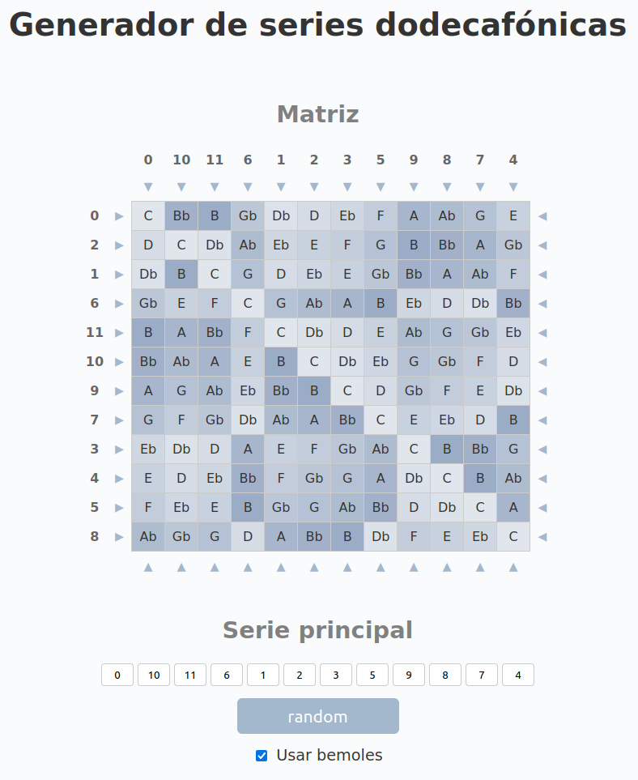

# 12Tone

A long ... loooong time ago ...

I was reading a about [serial music, 12 tone technique](https://es.wikipedia.org/wiki/Dodecafonismo)
and [Arnold Schoenberg](https://es.wikipedia.org/wiki/Arnold_Sch%C3%B6nberg) and decided
to make a 12 tone row calculator.

Refactored, added sounds and styles using [Google's Antigravity](https://antigravity.google/download/linux)
## ScreenShots

## Other examples

Later I found other instances of the same thing I had done:

- [music-theory-practice.com](https://music-theory-practice.com/post-tonal/twelve-tone-matrix)
- [agustinalonso.com](https://agustinalonso.com/12-tone-matrix-calculator)
- [jameswalkermathmusic.net](https://jameswalkermathmusic.net/mathematicsandmusic/Nav/MusicalMatrixCalculator/MatrixCalc.html)
- [musictheory.net](https://www.musictheory.net/calculators/matrix)